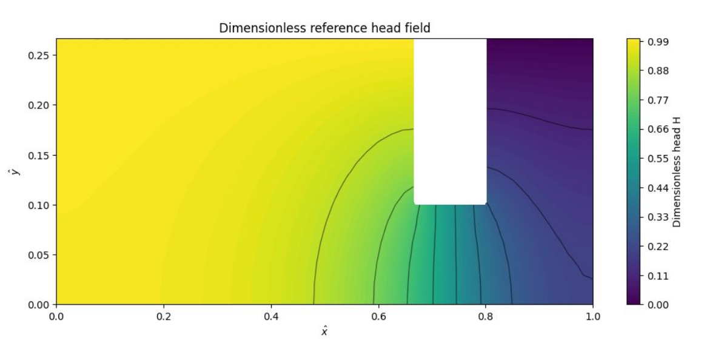

# PIIM: Physics-Informed Neural Networks on Darcy Flow below a Water Reservoir

This repository implements **Physics-Informed Neural Networks (PINNs)** to solve both forward and inverse groundwater seepage problems governing **Darcy Flow** beneath an impermeable dam reservoir structure.

---

## Authors & Affiliations

* **Marcos Aguilera Mateo**
* **Hervé Schmit-Veiler**
* **Alena Lara Weber**
* **Omar Abdesslem**

*Collaborative project across RWTH Aachen University, CAMINOS UPV, ETH Zürich, and GUT.*

---

## Table of Contents
1. [Problem Background](#problem-background)
2. [ 1: Non-Dimensionalization & Domain Setup](#-1-non-dimensionalization--domain-setup)
3. [ 2: Forward PINN Model](#-2-forward-pinn-model)
4. [ 3: Inverse PINN Model (Permeability Estimation)](#-3-inverse-pinn-model-permeability-estimation)
5. [Summary of Results](#summary-of-results)
6. [Future Work & Outlook](#future-work--outlook)

---

## Problem Background

Groundwater flow beneath hydraulic structures like concrete gravity dams is governed by **Darcy's Law** and the **principle of mass conservation (continuity)**. Accurately estimating the distribution of hydraulic total head $h$, seepage velocity, and hydraulic gradient $i = \nabla h$ is critical for assessing structural safety:
* **Effective Stresses & Bearing Capacity**: Water pressure directly impacts effective stress $\sigma' = \sigma - u$, where pore pressure $u = (h - z)\gamma_w$.
* **Erosion & Piping Risk**: High exiting hydraulic gradients can reach critical threshold values $i_{crit} = \frac{\gamma_{sub}}{\gamma_w}$, triggering internal piping erosion beneath the structure.

---

##  1: Non-Dimensionalization & Domain Setup

To stabilize network gradient updates and prevent scale imbalances during neural network training, the governing physical equations and spatial domain are scaled into dimensionless forms.

### Governing Equations

The dimensional groundwater flow equation is represented by Laplace's equation for total hydraulic head $h$:
$$\Delta h = \frac{\partial^2 h}{\partial x^2} + \frac{\partial^2 h}{\partial y^2} = 0$$

### Non-Dimensional Transformations

We introduce characteristic domain length $L$ alongside upstream ($h_1$) and downstream ($h_2$) water levels:
* $\hat{x} = \frac{x}{L}$
* $\hat{y} = \frac{y}{L}$
* $H = \frac{h - h_2}{h_1 - h_2} \implies h = h_2 + (h_1 - h_2)H$

This yields the dimensionless governing equation:
$$\frac{\partial^2 H}{\partial \hat{x}^2} + \frac{\partial^2 H}{\partial \hat{y}^2} = 0$$

### Boundary Conditions

| Boundary | Type | Condition |
| :--- | :--- | :--- |
| **Reservoir Inflow Boundary** | Dirichlet | $H = 1$ |
| **Catchment Outflow Boundary** | Dirichlet | $H = 0$ |
| **Vertical Impermeable Walls** | Neumann | $H_{,\hat{x}} = \frac{\partial H}{\partial \hat{x}} = 0$ |
| **Horizontal Impermeable Base & Dam Footprint** | Neumann | $H_{,\hat{y}} = \frac{\partial H}{\partial \hat{y}} = 0$ |

---

##  2: Forward PINN Model

The forward model trains a neural network $H_{\theta}(\hat{x}, \hat{y})$ to estimate the spatial hydraulic pressure head distribution purely driven by physics constraints, requiring no pre-existing mesh simulation data during training.

   Input (x, y)
         │
         ▼
┌──────────────────────┐
│ Fully Connected Neural│
│ Network [2]+[25]*6+[1]│
└──────────────────────┘
│
▼
Predicted Head (h)
│
┌───────┴────────┐
▼                ▼
PDE Loss (Δh=0)    BC Losses (Dirichlet & Neumann)
│                │
└───────┬────────┘
▼
Total Adaptive Loss

### Network Architecture & Loss Function
* **Architecture**: Deep Fully-Connected Neural Network with 6 hidden layers, each having 25 neurons ($[2] \to [25] \times 6 \to [1]$).
* **Total Loss Function**:
  $$L_{tot} = \lambda_{PDE} L_{PDE} + \sum \lambda_{BC} L_{BC}$$
  where $L_{PDE} = \text{MSE}(\Delta H)$, $L_{BC, Dirichlet} = \text{MSE}(H - H_{bc})$, and $L_{BC, Neumann} = \text{MSE}(H_n)$.

### Optimization Strategy
1. **Fixed-Weight PINN (Baseline)**: Suffers from optimization plateaus due to static loss balancing.
2. **Adaptive Weighting (NKTS) + Hybrid Optimizer**:
   * **Adam Optimizer**: Trained for ~10,000–15,000 epochs with adaptive loss weights to reliably explore global minima.
   * **L-BFGS Fine-Tuning**: Switched to second-order optimization for ~4,000 extra iterations to accelerate convergence near boundary constraints.
   * **Accuracy Achieved**: Absolute error metric accuracy $> 91.9\%$ compared against reference Finite Element Method (FEM) solutions.

---

##  3: Inverse PINN Model (Permeability Estimation)

The inverse PINN model estimates the hidden material parameter—hydraulic conductivity ($k$)—from sparse observed velocity magnitude fields ($v_{real}$) while simultaneously refining the total head field.

### Inverse Problem Formulation
* **Darcy's Law Velocity**:
  $$v^* = k \cdot |\nabla h|$$
* **Enforcing Positivity Constraint**: Hydraulic conductivity must satisfy $k > 0$. We define $k$ as a trainable neural network scalar parameter $k_{raw}$, mapped via a Softplus activation:
  $$k = \text{softplus}(k_{raw})$$
* **Velocity Loss Function**:
  $$L_v = \text{MSE}(v_\theta, v^*) = \frac{1}{N} \sum_{i=1}^{N} \left( k |\nabla h_\theta(x_i, y_i)| - v_{real, i} \right)^2$$
* **Joint Optimization Objective**:
  $$L_{inverse} = L_{PDE} + \lambda_D L_D + \lambda_N L_N + \lambda_v L_v$$
  *A higher weight ($\lambda_v = 100$) strongly aligns predicted flow velocity with physical observations.*

### Training Mechanics
To accelerate joint optimization, the model loads pre-trained weights from  2 as an initial starting point (warm-start strategy) and updates head parameters $\theta$ and parameter $k$ simultaneously via Adam optimization.

---

## Summary of Results

### Performance Metrics

|  | Metric | Value | Reference / Target |
| :--- | :--- | :--- | :--- |
| ** 2 (Forward)** | Model Accuracy | **91.9%** | FEM Benchmark Solution |
| ** 3 (Inverse)** | Estimated Permeability ($k$) | **1.108 m/day** | $k_{true} = 1.000\text{ m/day}$ ($10.8\%$ error) |
| ** 3 (Velocity)** | Normalized Velocity RMSE | **5.77%** | Ground Truth Velocities |
| ** 3 (Velocity)** | Normalized Velocity MAE | **4.79%** | Ground Truth Velocities |
| ** 3 (Velocity)** | Coefficient of Determination ($R^2$) | **0.9286** | Ground Truth Velocities |

---

## Future Work & Outlook

* ** Parametric PINN Framework**: Extend inputs from $(\hat{x}, \hat{y})$ to $(\hat{x}, \hat{y}, h_1)$, enabling instantaneous seepage prediction across dynamic reservoir water levels without requiring full model retraining.
* **Noise Robustness**: Benchmark the parameter estimation quality of hydraulic conductivity $k$ when synthetic measurement noise is injected into observed velocity vectors.
* **Geometrical Generalization**: Generalize the domain boundaries to account for heterogeneous soil strata beneath dams.
